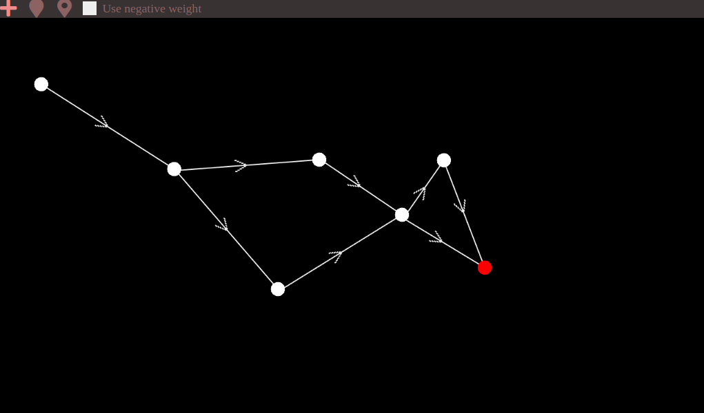
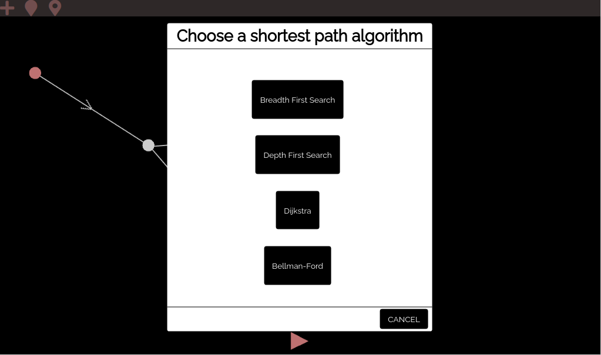
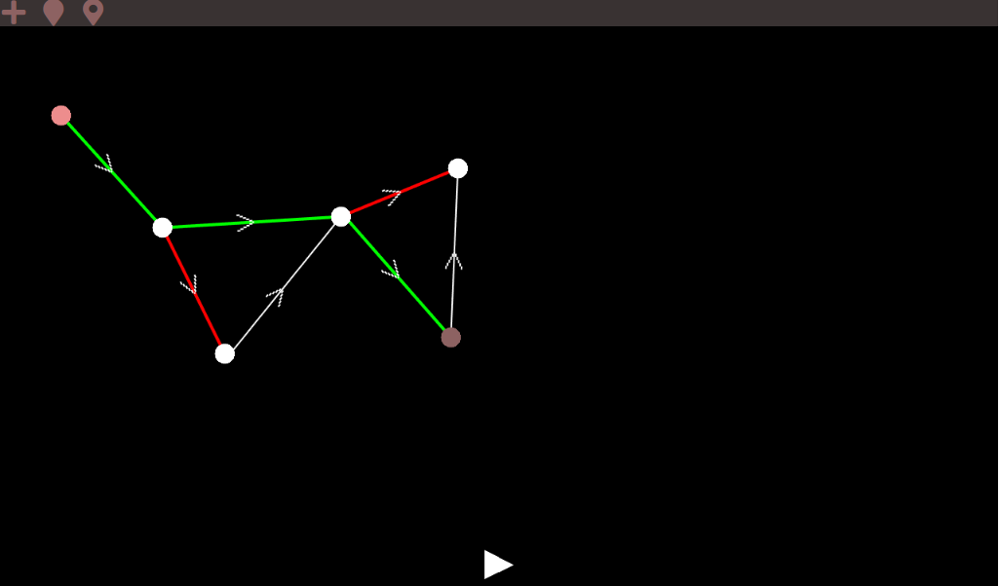

# Search Visualizer

**Número da Lista**: 6
**Conteúdo da Disciplina**: Final

## Alunos

| Matrícula  | Aluno                          |
| ---------- | ------------------------------ |
| 17/0114040 | Samuel de Souza Buters Pereira |
| 17/0010341 | Gabriel Davi Silva Pereira     |

## Sobre

O search visualizer é um projeto para visualização de difetentes algoritmos de busca em grafos, sejam eles direcionais ou não direcionais.

## Screenshots







## Instalação

**Linguagem**: Javascript<br>
**Framework**: Phaser<br>

### Para rodar localmente:

- Baixe ou clone este repositório
- Navegue até o diretório raiz do projeto e rode o comando:

```
$ python -m http.server 8080
```

ou use qualquer servidor http de sua preferência.

- Em um navegador (google chrome recomendado), vá para o endereço `localhost:8080`

## Uso

- Após rodar a aplicação, clique no botão de mais e monte o seu grafo;
- Após a conclusão do grafo, escolha o nó inicial clicando no ícone logo a direta do botão de mais e clicando no nó que será o inicial;
- Após a escolha do nó inical, escolha o nó final cliacando no ícone logo a direta do icone de escolher o nó inicial, e clique no nó que deseja que seja o final;
- Em seguida, um pop up irá aparecer em tela para que seja escolhido o algoritmo para ser executado, escolha o algoritmo de sua preferência;
- O código irá executar e todo o algoritmo irá ser representado de forma visual;
